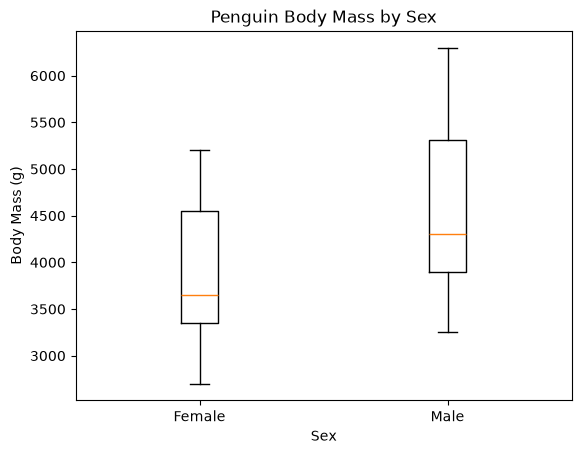

# Luke Stevers - Exploratory Data Analysis

Welcome to my Module 4 Exploratory Data Analysis project.

This project demonstrates a repeatable process for exploring datasets with Python, pandas, Seaborn, Matplotlib, and Jupyter notebooks.

## Project Overview

This project includes two related analyses.

### Penguin Analysis

I extended the provided Palmer Penguins analysis by comparing **body mass between female and male penguins**.

The analysis uses a box plot to compare the body-mass distributions of the two groups.

The results show a noticeable difference in body mass between the female and male penguins in the dataset, with male penguins generally having higher body mass values.

### Custom Automobile EDA

For my custom exploratory analysis, I used the Seaborn `mpg` dataset.

My project question was:

> **What vehicle characteristics are associated with differences in fuel efficiency?**

The dataset contains 398 vehicles and includes variables such as:

- Miles per gallon
- Number of cylinders
- Engine displacement
- Horsepower
- Vehicle weight
- Acceleration
- Model year
- Country of origin

## Key Findings

### Weight and MPG

The strongest relationship I investigated was between vehicle weight and fuel efficiency.

The correlation between vehicle weight and MPG was:

**r = -0.832**

This indicates a strong negative association in this dataset: heavier vehicles generally have lower fuel efficiency.

### Cylinders and MPG

Fuel efficiency also differs by number of cylinders.

The analysis showed that 4-cylinder vehicles generally have higher MPG values, while 8-cylinder vehicles generally have lower MPG values.

### Origin and MPG

I also compared fuel efficiency by vehicle origin.

The distributions showed differences among vehicles from the United States, Japan, and Europe, although the groups have considerable overlap.

## Data Quality

The `mpg` dataset contains:

- **398 rows**
- **9 variables**
- **6 missing horsepower values**
- **0 duplicate rows**

Checking data quality was an important first step before interpreting relationships in the dataset.

## Custom EDA Notebook

The complete custom analysis is available in my Jupyter notebook:

[**View the Custom EDA Notebook on GitHub**](https://github.com/lukestevers/module4/blob/main/notebooks/eda_lukestevers.ipynb)

The notebook follows this workflow:

1. Load the data
2. Inspect the data
3. Check data quality
4. Describe numerical variables
5. Visualize distributions
6. Explore relationships
7. Compare MPG by number of cylinders
8. Compare MPG by vehicle origin
9. Summarize findings and identify next steps

## Skills Demonstrated

This project demonstrates skills in:

- Python
- pandas
- Seaborn
- Matplotlib
- Jupyter notebooks
- Exploratory Data Analysis
- Data-quality checks
- Descriptive statistics
- Missing-value analysis
- Correlation analysis
- Data visualization
- Grouping and filtering
- Git and GitHub
- UV project management
- Zensical documentation

## Possible Next Steps

If I continued this analysis, I would investigate:

- Whether the weight-MPG relationship changes across model years
- How horsepower relates to fuel efficiency
- How displacement relates to MPG
- Whether origin differences remain after accounting for vehicle weight
- How fuel efficiency changed over time

## Project Repository

The complete source code and analysis are available on GitHub:

[**Luke Stevers - Module 4 Repository**](https://github.com/lukestevers/module4)
